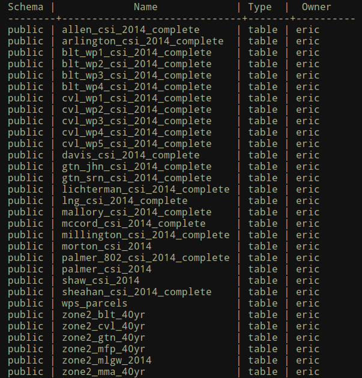
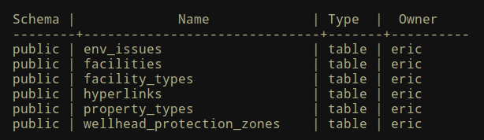

layout: true
class: center, middle, inverse
---
#COMP 4115 Project:
##Contaminant Source Inventory database redesign
Eric Goddard  
github presentation: [http://egoddard.github.io/comp4115-project](http://egoddard.github.io/comp4115-project)  
github repo: [https://github.com/egoddard/comp4115-project](https://github.com/egoddard/comp4115-project)

---

layout: false
class: left, middle
#Outline
.left[
- Project Summary
- What I wanted to accomplish
- What I actually accomplished
- How I did it
]

---

class: center, inverse
#Summary
###When groundwater wells are drilled, the EPA requires creation of a wellhead protection plan. 
###Part of the protection plan includes maintaining an inventory of facilities with hazardous materials that could contaminate the well if a leak were to occur.

---

#What I wanted to accomplish
###1. Create a consolidated, normalized database design that will make it easier to update and generate annual reports. (Completed) 
--

###2. Migrate historical data into the new database. (Completed) 
--

###3. Automate updating of the source regulatory data. 
--

###4. Automate the generation of reports. (Completed) 

---

class: center
##Turn this:  

---
class: center
##Into this:

---

class: center, middle
#The End
##Links
github presentation: [http://egoddard.github.io/comp4115-project](http://egoddard.github.io/comp4115-project)  
github repo: [https://github.com/egoddard/comp4115-project](https://github.com/egoddard/comp4115-project)

