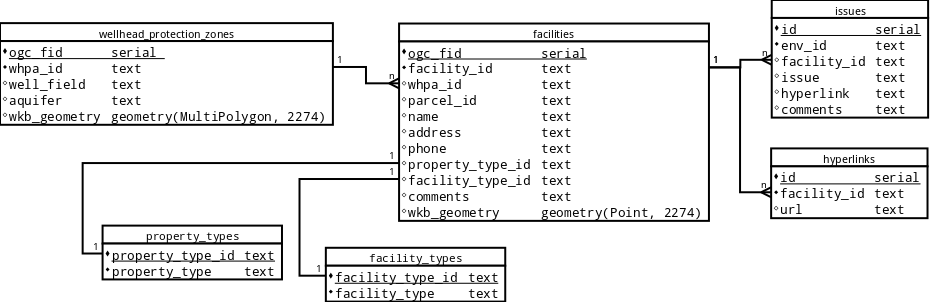

##Introduction
My project is a redesign of a Contaminant Source Inventory (CSI) database. 
When groundwater wells are drilled, the EPA requires that a wellhead protection 
plan be developed and updated annualy. Part of the protection plan includes 
keeping a record of sites that use hazardous chemicals/materials in the vicinity 
of a well that, if a leak were to occur, could potentially contaminate the 
groundwater.

The goals of the project were to: 

    1. Create a consolidated, normalized database design that will make it easier 
       to update and generate annual reports. (Completed) 
    2. Migrate historical data into the new database. (Completed) 
    3. Automate updating of the source regulatory data. 
    4. Automate the generation of reports. (Completed) 

The Github repo is at [https://github.com/egoddard/comp4115-project](https://github.com/egoddard/comp4115-project). 
The Github presentation link is [http://egoddard.github.io/comp4115-project](http://egoddard.github.io/comp4115-project).

##Goals
###1 and 2: normalization and migration
The source database consists of 26 wellhead protection area (WHPA) boundaries 
across six tables and 1,785 facilities of interest within the WHPA boundaries 
spread across 24 tables. In addition to descriptive fields such as facility 
name, address, phone number, etc., each of the 24 tables contains between 
one and nine paired columns that represent an environmental issue id number and 
description. The list of attributes in each of the CSI tables can be seen in 
[schema/csi_fields.md](../schema/csi_fields.md). 

 

The new schema design (Figure 1) contains six tables: facilities, hyperlinks, 
facility\_types, property\_types, env\_issues, and wellhead\_protection\_zones. 
The major difficulty at this phase was in the migration phase. Due to the number 
of sources (24 input tables with values that need to be written across three new 
tables), I preferred a dynamic approach to creating and migrating the data. However, 
columns are not named consistently across all of the tables, presenting some 
difficulty which was overcome by querying the information_schema tables in the 
for loop. 

The other considerable problem I encountered while migrating the data was caused 
by the varying number of duplicate hyperlink and environmental columns. I worked 
on the hyperlinks first since they were a simpler problem. I was able to move 
them using a 2-step process in a for loop:  

    1. Select all of the column names like hyperlink into an array from the 
       information_schema.columns table  
    2. Use the UNNEST function in the INSERT INTO...SELECT statement to turn 
       the hyperlinks field names array into column identifiers.

The environmental columns were solved with the same kind of setup, but were 
further complicated because I needed to extract the information in pairs, and 
the number of paired columns varied by table. For example, the 
`CVL_WP4_CSI_2014_Complete` table contains the following environmental pairs:  
__Identifier -- Description__  
ENV\_ID1 -- ENV\_Data1 

`Allen_CSI_2014_Complete`, on the other hand, has the following pairs:  
__Identifier -- Description__  
ENV\_ID1a -- ENV\_Data1  
ENV\_ID2A -- ENV\_Data2  
ENV\_ID3A -- ENV\_Data3  
ENV\_ID4 -- ENV\_Data4  
ENV\_ID5 -- ENV\_Data5  
ENV\_ID6 -- ENV\_Data6  
ENV\_ID7 -- ENV\_Data7  
ENV\_ID8 -- ENV\_Data8  
ENV\_ID9 -- ENV\_Data9  

Moving these values as pairs into the env_issues table required building up an 
`INSERT` query one pair of environmental fields at a time using `UNION`.

The code for migrating the wellhead protection areas is in 
[scripts/merge_zones.sql](../scripts/merge_zones.sql), but it was straightforward. 
After the zones are merged and facilities populated, a PostGIS spatial query 
is used to assign the whpa\_id from the zones to the whpa\_id field in the 
facilities table where their geometries intersect.

The code to create the normalized schema is in 
[scripts/schema_transformation.sql](../scripts/schema_transformation.sql). The 
code to populate the facilities is in 
[scripts/populate_facilities.sql](../scripts/populate_facilities.sql).

##3 - Automate updating of the source regulatory data
The current process of updating existing CSI records and adding new facilities 
is a tedious exercise that involves manually downloading data sets from many 
sources, editing certain fields, verifying locations, and manually entering the 
new information into the database. Going into the project, I thought this would 
be the easiest task since each facility has an ID, and the Environmental 
Protection Agency (EPA) has an API for querying facilities. I was very wrong.

It turns out that facilities do not have a consistent, unique identifier. The EPA 
has registry IDs for some facilities (or multiple IDs for a single facility), 
which may or may not be associated with the Tennessee Department of Environment 
and Conservation's (TDEC) facility identifier. Using a combination of other 
fields as a unique identifier, such as the facility name and address, is also 
not possible because those values have been edited for formatting. 

I am still working on a solution to the updating problem. At the least, I think 
the new schema will make updating the data more straightforward.

##4 - Automate the generation of reports
After the CSI data in each well's wellhead protection plan has been updated and 
a windshield survey conducted for verification, reports are generated for each
WHPA for distribution to TDEC and the local water authorities. The preferred 
format is a spreadsheet. With the old schema this was a very time consuming 
process because the data was spread out and required manual compilation. With 
the new relational model, this is a very simple task.

First, a view was created that consolidates all of the information required 
for the report into one table. Using the psycopg2 and xlwt libraries with 
Python, a script was written to query for each WHPA and export an Excel 
spreadsheet. The code for the view is in 
[scripts/report_view.sql](../scripts/report_view.sql). The Python code is in 
[scripts/generate_report.py](../scripts/generate_report.py).

#Conclusion
This project was a decent introduction to database redesign using a real-world 
dataset. I became very dependent on the Postgres array datatype, to the point 
that dealing with the multiple duplicate columns would be very difficult without 
arrays. 

Unfortunately I am unable to include the database, but assuming one had the 
database, the following sequence of commands would load the source data into 
the csi postgres database, create the new tables, migrate the data, drop the 
source tables, create the report view, and finally generate reports:
```bash
createdb gwi_csi
./scripts/load_csis.sh
psql -d gwi_csi -a -f scripts/schema_transformation.sql
psql -d gwi_csi -a -f scripts/merge_zones.sql
psql -d gwi_csi -a -f scripts/populate_facilities.sql
psql -d gwi_csi -a -f scripts/drop_source_data.sql
psql -d gwi_csi -a -f scripts/report_view.sql

python generate_report.py
```
